<p align="center">
  
  
</p>

This repository provides an indoor Optical Wireless Positioning (OWP) + Inertial Measurement Unit (IMU) fusion positioning dataset comprising over **110 K** continuous samples collected over more than **80 minutes**. The data acquisition rates are:

- **RSS measurements**: 27 Hz  
- **IMU readings**: 200 Hz  
- **Ground truth (position & attitude)**: 160 Hz  

**keywords**: Visible Light Positioning (VLP), Indoor positioning dataset, infrared light, photodiode (PD), Indoor positioning service (IPS), Optical Wireless Positioning (OWP), Visible Light Communication (VLC).

Download Link: [https://github.com/DRAMCO/OWP-IMU-Dataset](https://github.com/DRAMCO/OWP-IMU-Dataset)

Contributor: Fan Wu, Jorik De Bruycker, Daan Delabie.

Paper: [https://arxiv.org/pdf/2505.16823](https://arxiv.org/pdf/2505.16823)

Credits:
```
@misc{wu2025owpimurssbasedopticalwireless,
      title={OWP-IMU: An RSS-based Optical Wireless and IMU Indoor Positioning Dataset}, 
      author={Fan Wu and Jorik De Bruycker and Daan Delabie and Nobby Stevens and Francois Rottenberg and Lieven De Strycker},
      year={2025},
      eprint={2505.16823},
      archivePrefix={arXiv},
      primaryClass={eess.SP},
      url={https://arxiv.org/abs/2505.16823}, 
}
```


# Dramco Setup

<p align="center">
  
</p>

The vehicle traverses the floor while on-board sensors capture RSS values from ceiling-mounted infrared LEDs.

## Visual Overview

<table align="center">
  <tr>
    <td align="center">
      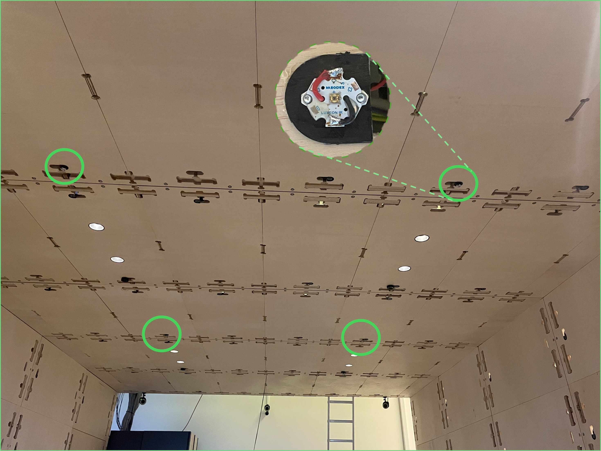
      <p align="center">The ceiling is equipped with four infrared LEDs, each modulated at a unique frequency for optical ranging calibration.</p>
    </td>
    <td align="center">
      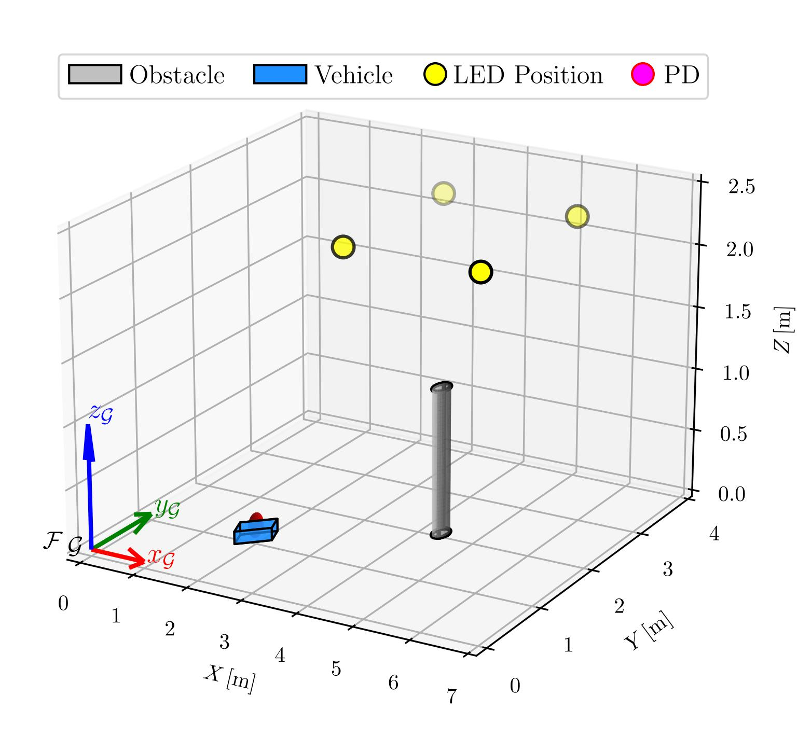
      <p align="center">Schematic annotation includes LED mounting positions.</p>
    </td>
  </tr>
</table>

---

# Datasets Details

**Table 1. Platform Setup Parameters**

<p align="center">
  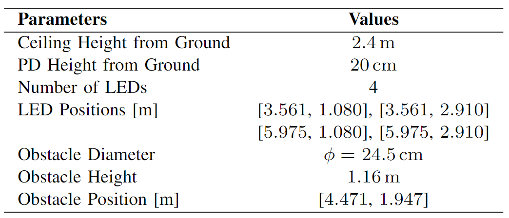
</p>

The LEDs orders are 

[ (4) (3) ]

[ (2) (1) ]

with corresponding coordinates:

- **LED 4**: [3.561, 1.080] m  
- **LED 3**: [3.561, 2.910] m  
- **LED 2**: [5.975, 1.080] m  
- **LED 1**: [5.975, 2.910] m

**Table 2. Recorded Dataset Formats**

<p align="center">
  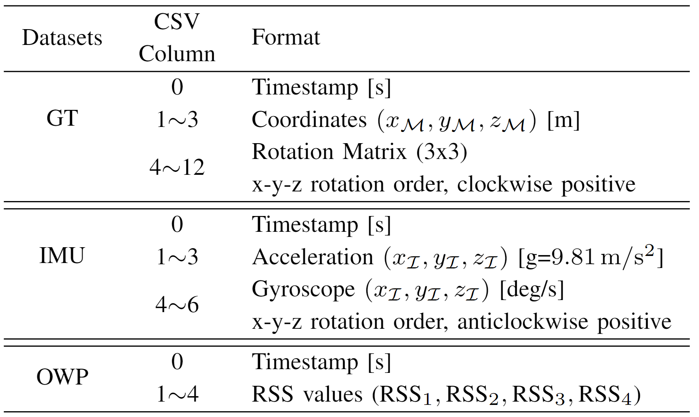
</p>


## Motion Trajectory

<p align="center">
  
</p>

A real-time playback of the platform’s path through the test area.

### Acceleration

<p align="center">
  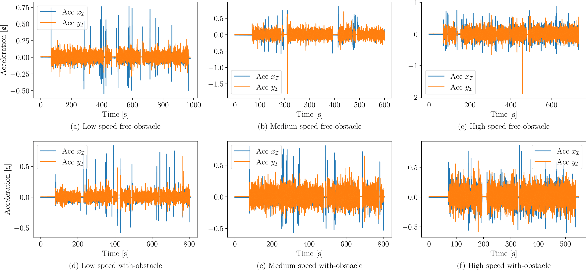<br>
</p>

### Angular Velocity

<p align="center">
  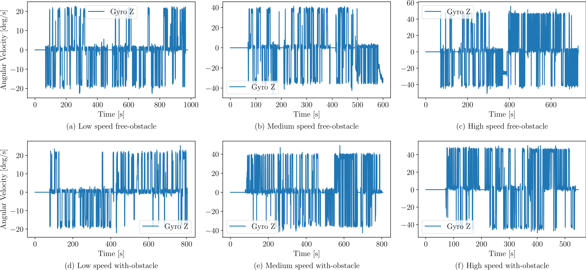<br>
</p>

## EKF Results

<table align="center">
  <tr>
    <th>Without Obstacle</th>
    <th>With Obstacle</th>
  </tr>
  <tr>
    <td align="center">
      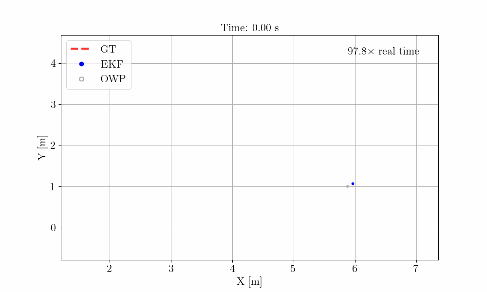<br>
      Low Speed 0.15 m/s
    </td>
    <td align="center">
      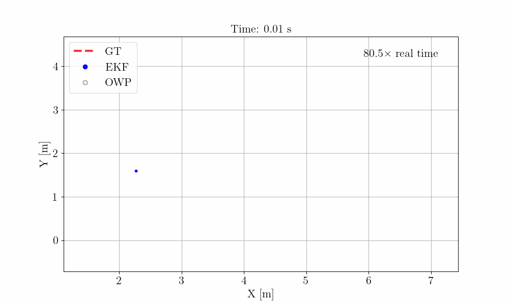<br>
      Low Speed 0.15 m/s
    </td>
  </tr>
  <tr>
    <td align="center">
      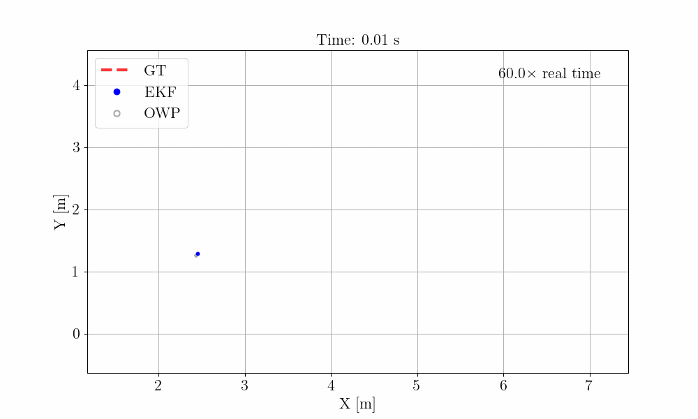<br>
      Medium Speed 0.275 m/s
    </td>
    <td align="center">
      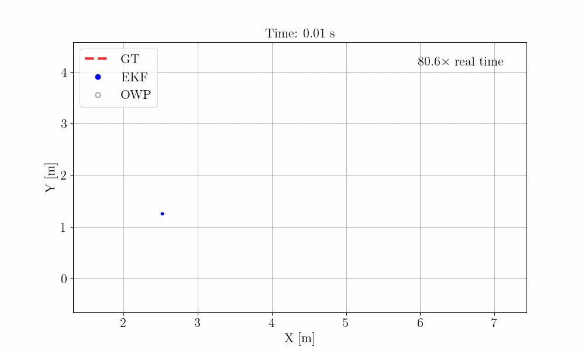<br>
      Medium Speed 0.275 m/s
    </td>
  </tr>
  <tr>
    <td align="center">
      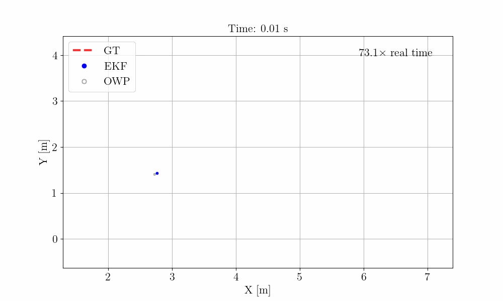<br>
      High Speed 0.45 m/s
    </td>
    <td align="center">
      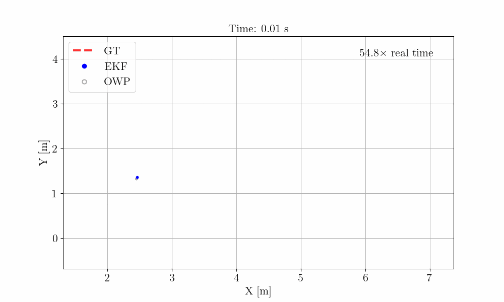<br>
      High Speed 0.45 m/s
    </td>
  </tr>
</table>

